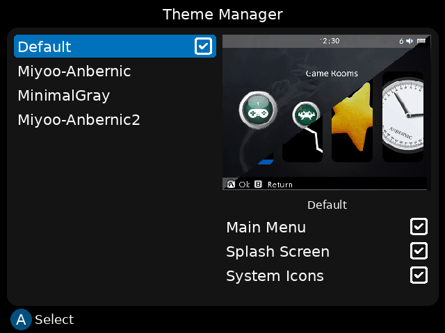
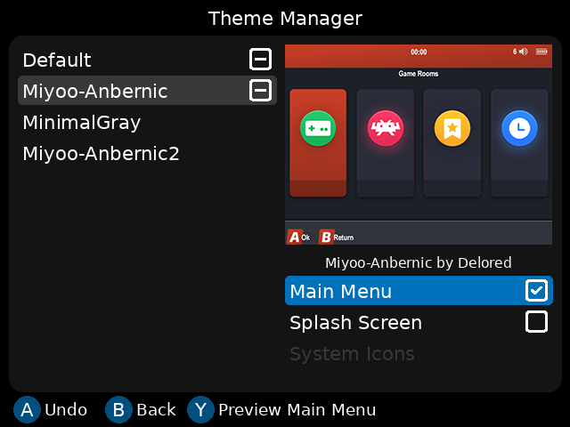

# ThemeManager for RG35XX Stock OS

The latest version of the RG35XX stock OS offers stability and performance that surpasses many custom OS options. However, its interface design leaves much to be desired.

ThemeManager is here to change that. This application allows you to easily manage and apply different themes, enhancing the aesthetic appeal of your RG35XX device.

  
  

## Compatibility
ThemeManager is fully compatible with the official 1.1.5 firmware for the Anbernic RG35XX H/Plus.

## Installation
1. Download the zip file from [ThemeManager.zip](https://github.com/tahirduran/ThemeManager-RG35XX-StockOS/releases/download/v1.001/ThemeManager-v1.001.zip).

2. Extract the contents of the zip file and copy the extracted files to the `/mnt/mmc/Roms/APPS` folder on your RG35XX device.

3. Navigate to App Center -> Apps to launch the ThemeManager application.

## Adding Themes

The app includes a few pre-installed themes, but if you want to add more themes:

1. Copy the theme files into the `ThemeManagerFiles/themes` folder.

2. For theme previews, you can add a `theme.png` image and an `info.json` file inside the theme folder.

